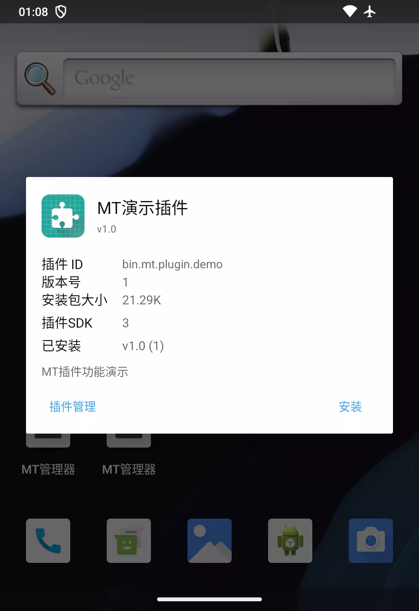
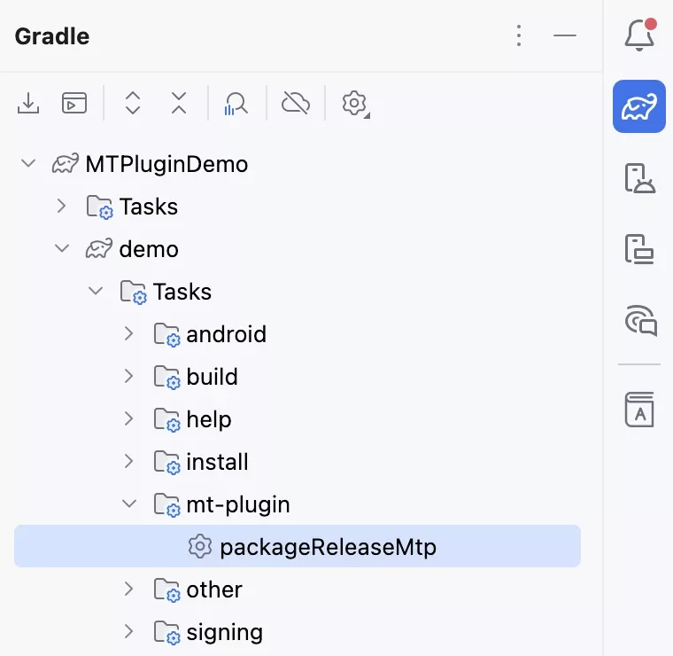
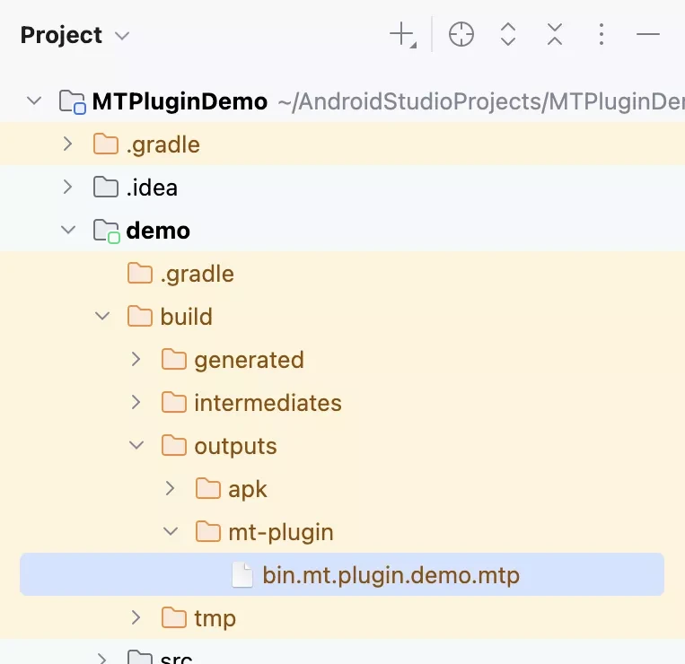
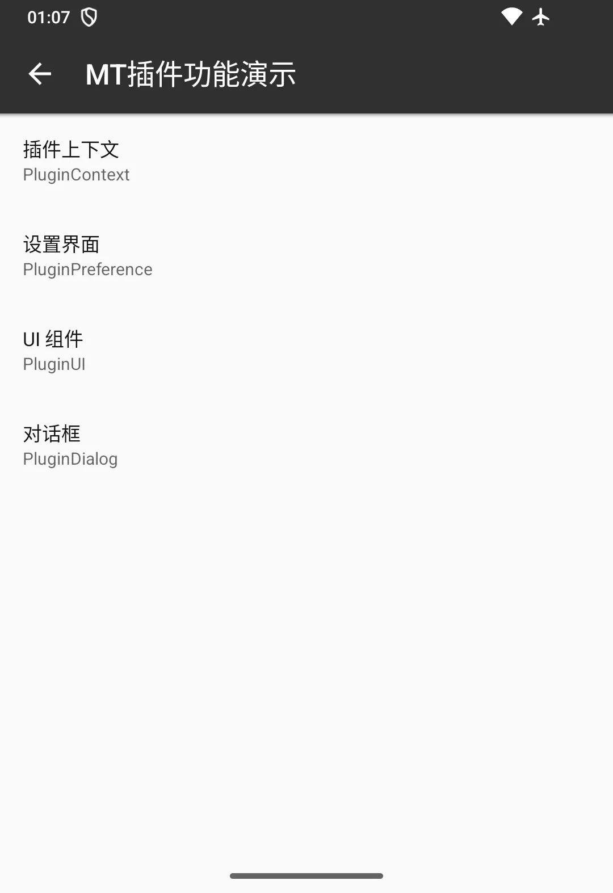
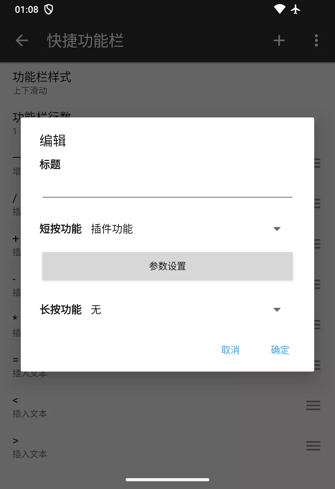
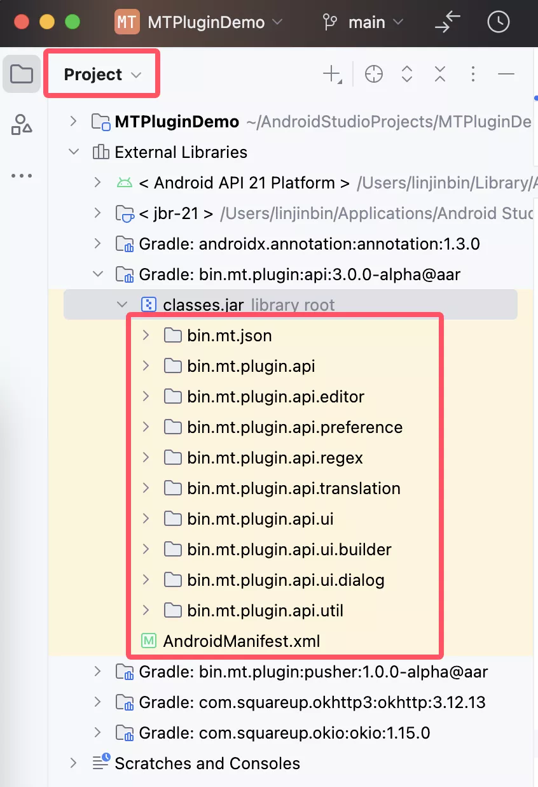

# MT Plugin V3 Demo

当前插件 SDK 版本为 3.0.0-alpha，这是一个不稳定版，后续仍会对 API 做进一步调整，该版本插件需要在 MT 管理器
2.19.1 上运行。

## V3 版本功能亮点

v2 版本的插件仅提供了翻译接口和简易的设置界面功能，在 v3 版本中我们进行了以下更新：

### 一、升级至 Java 1.8

内置的插件 Java 编译器由 1.7 升级至 1.8，其中最重大的变化就是可以使用 Lambda 表达式，代码可以编写得更加简洁。

另外现在 MT 管理器的 minSdk 是 21，因此这次也将编译器所使用系统库升级到了 Android 5.0。

### 二、新增 UI 组件接口

提供了基本 UI 组件与对话框创建功能，而且并非直接提供安卓原生接口，而是通过 PluginUI 实例和各类 UI
组件的包装接口去创建，更加简单易用。

具体用法请参考代码文件：

- `app/src/main/java/bin/mt/plugin/demo/preference/ExampleUI.java`
- `app/src/main/java/bin/mt/plugin/demo/preference/ExampleDialog.java`

### 三、新增文本编辑器接口

目前计划新增 4 个接口，已完成 1 个：

- [x] 底部快捷功能扩展接口
- [ ] 工具菜单扩展接口
- [ ] 浮动菜单扩展接口
- [ ] 代码补全接口

### 四、增强的设置界面

支持自定义点击事件和打开其它设置界面

具体用法请参考代码文件：

- `app/src/main/java/bin/mt/plugin/demo/preference/ExamplePreference.java`
- `app/src/main/java/bin/mt/plugin/demo/preference/ExampleMain.java`

## 更新记录

### plugin-api alpha4

对应 MT 管理器版本号需大于 **25092100**

- `TextEditor` 的 `pushSelectPositionToUndoBuffer` 方法重命名为 `pushSelectionToUndoBuffer`
  - **因为这个改动，已安装的插件如果调用了此方法，需修改代码后重新安装**
- `TextEditorFunction` 新增 `isEnabled()` 方法用于动态控制功能接口是否启用
- 对大量注释文档进行优化，表述更加准确与清晰

### plugin-api alpha3

对应 MT 管理器版本号需大于 **25092000**

- 安装插件时将检测安装包的 assets 目录内所有 mtl 文件格式是否正确，检测失败将无法安装
- 语言包 mtl 文件支持多行文本，具体请参考文件：`app/src/main/assets/example.mtl`
- `PluginContext` 新增 `getPluginSdkVersion()` 方法用于获取插件 SDK 版本号
- `PluginContext` 和 `PluginUI` 显示 Toast 方法的格式化参数支持自动转为本地化文本
- `TextEditor` 的 `replace` 方法重命名为 `replaceText`
- `TextEditor` 的 `replaceText` 和 `insertText` 方法的 text 参数类型调整为 `CharSequence`
- `BaseTextEditorFunction` 的代码添加详细注释说明

### plugin-api alpha2

对应 MT 管理器版本号需大于 **25091900**

- `BufferedText` 类源码注释增加关于换行符的说明
- `Regex` 类源码注释增加关于 MT 正则表达式库的说明
- `PluginContext` 中剪贴板方法的文本类型改为 `CharSequence`
- `PluginContext` 新增 `openLogViewer()` 方法用于打开插件日志查看器
- `PluginContext` 和 `PluginUI` 显示 Toast 方法的消息参数类型改为 `CharSequence`
- `PluginContext` 和 `PluginUI` 新增 `cancelToast()` 方法用于取消当前正在显示的 Toast
- `PluginUI` 的 `isStrictIdModeEnabled()` 方法注释补充**默认开启** ID 严格模式的说明
- `PluginUI` 新增多个获取颜色方法：
  - 错误颜色：`colorError()`
  - 警告颜色：`colorWarning()`
  - 分割线颜色：`colorDivider()`
  - 带状态的主要文本颜色：`colorTextStateList()`
  - 带状态的次要文本颜色：`colorTextSecondaryStateList()`
- 去除 `PluginUI.StyleWrapper` 新增 `PluginUI.Style.Modifier`，对于修改已有Style：
  - 旧写法：`new PluginUI.StyleWrapper(pluginUi.getStyle()) { ... }`
  - 新写法：`pluginUi.getStyle().new Modifier() { ... }`

## 如何运行本项目

在这之前请安装正确版本的 MT 管理器

### 通过 Android Studio（推荐）

#### 一、自动打包插件并推送到设备上安装

1. 使用最新版本的 Android Studio 打开本项目，本文编写时最新版本为
   `Android Studio Narwhal 3 Feature Drop | 2025.1.3`
2. 等待 Gradle 同步完成后直接运行 app 模块，将会有一个名为 `MT Plugin Plusher` 的应用程序被安装到您的设备上并自动启动
3. `MT Plugin Plusher` 启动后将会打开 MT 管理器的插件安装界面，点击安装即可

#### 二、仅打包插件

1. 打开 Gradle 面板（一般在右上角的侧栏里）
2. 运行 `app/Tasks/mt-plugin/packagePlugin` 任务
3. 任务运行成功后可以在 `app/build/mt-plugin` 目录找到打包好的 mtp 插件安装包

  
  

### 通过命令行

1. 在项目根目录执行 `./gradlew app:packagePlugin`
2. 命令执行成功后可以在 `app/build/mt-plugin` 目录找到打包好的 mtp 插件安装包

## 如何测试插件功能

插件安装成功后，进入 `MT 管理器主界面` > `侧边栏` > `工具分组` > `插件管理` > `MT演示插件` > `设置`
即可看到关于插件上下文、设置界面、UI 组件、对话框的功能演示，相关代码在
`app/src/main/java/bin/mt/plugin/demo/preference` 文件夹内

进入 `文本编辑器` > `设置` > `功能分组` > `编辑快捷功能栏`，添加或者编辑一个功能，展开功能选项列表，点击
`插件功能` > `参数设置` 即可看到插件提供的功能，相关代码在文件
`app/src/main/java/bin/mt/plugin/demo/TextEditorFunctionDemo.java`

## API 文档

API 文档尚未完成，不过 API 源码中有详细的注释，可根据下图找到所有的 API 源码：

