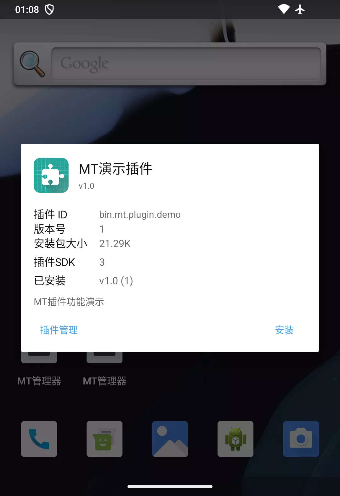
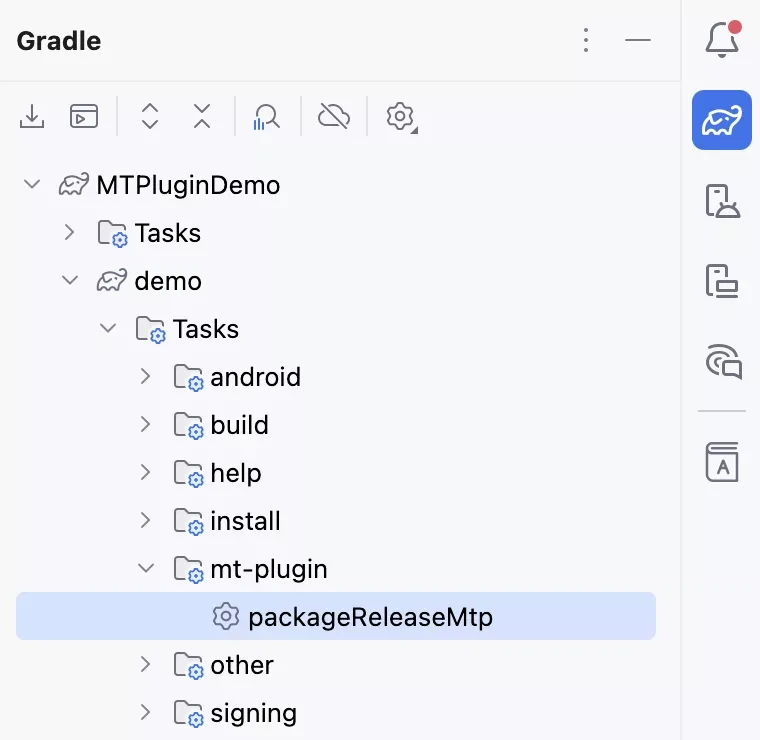
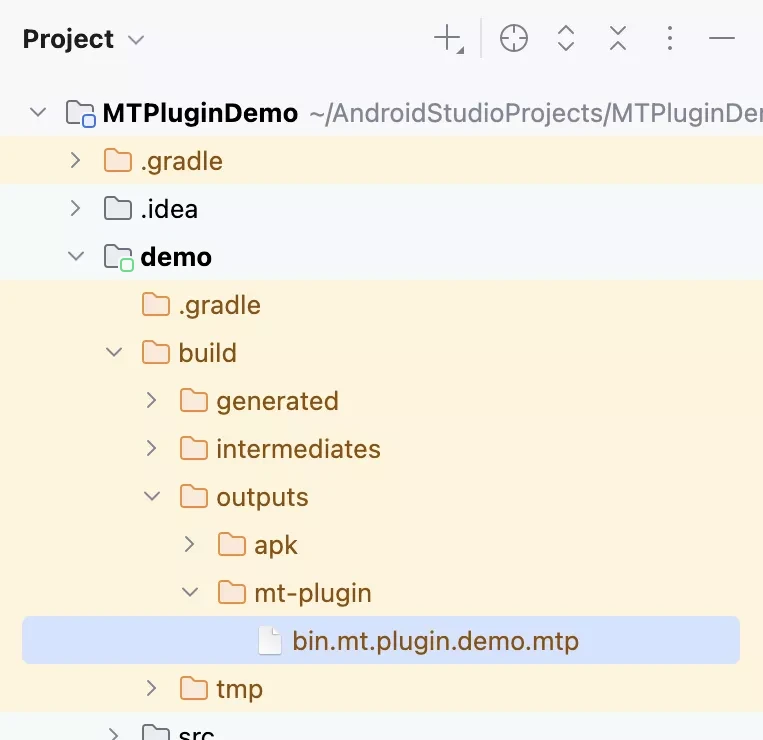
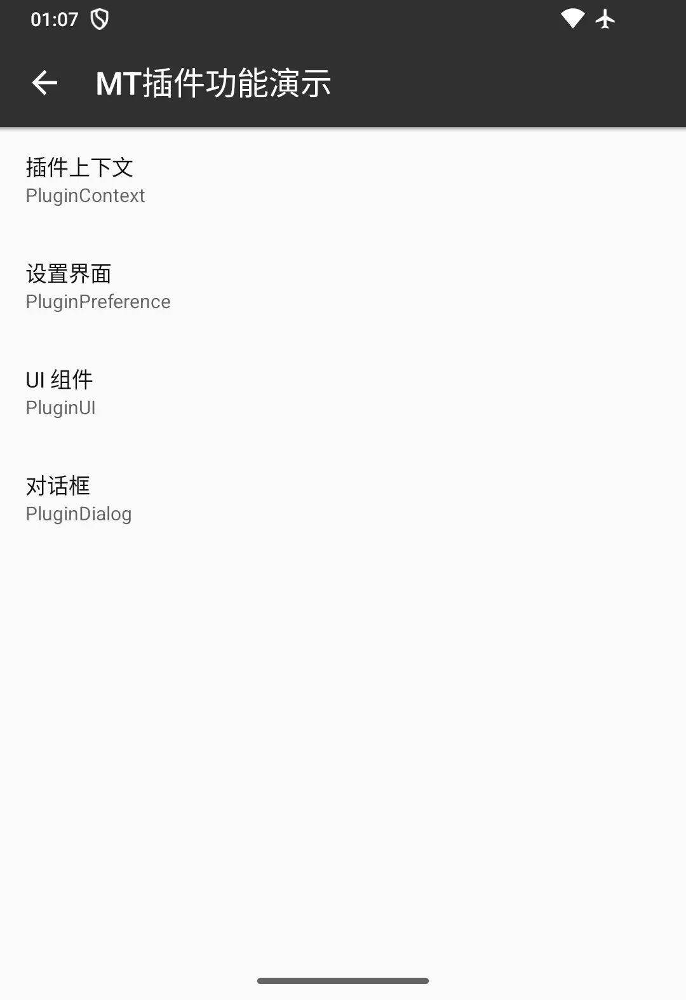
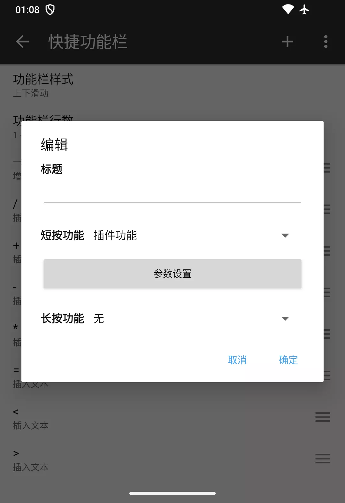
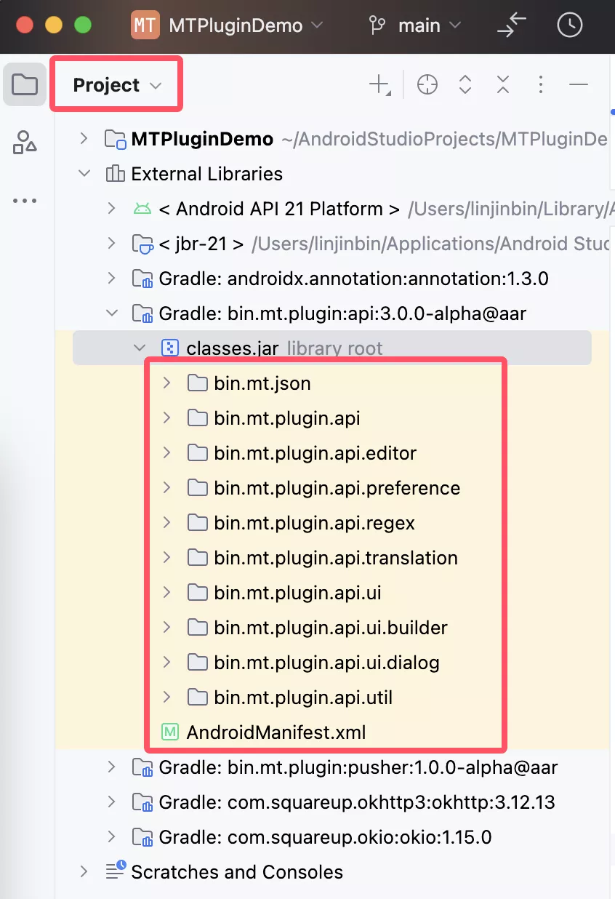

# MT Plugin V3 Demo

欢迎加入 MT 插件开发 QQ 交流群：422326626

## V3 版本功能亮点

v2 版本仅提供了翻译接口和简易设置界面，v3 版本进行了以下升级：

### 一、使用 AGP 构建

v3 版本插件新增 dex 打包模式，可将 AGP 编译生成的 classes.dex 直接打包到 mtp 文件中，而非打包 .java 与 .jar 文件。

这意味着可以使用 AGP 的很多特性来进行 MT 插件开发：
- 支持更高的 Java 版本（只要 AGP 支持）
- 支持 coreLibraryDesugaring 核心库脱糖
- 支持 Kotlin

为此我们也专门开发了一个 gradle 插件：
- 支持一键打包出 mtp 文件
- 支持一键将 mtp 文件推送到手机上安装

### 二、增强翻译引擎接口

- 支持限制单次翻译的最大文本长度：翻译大文本时 MT 会自动对文本进行智能拆分，依次翻译后再进行合并
- 支持在翻译模式中进行批量翻译：将多个词条通过分割线拼接后统一翻译，再按分割线拆分结果，减少网络往返请求次数，提升在线翻译效率
- 以上两个功能只需设置 `TranslationEngine.Configuration` 中的相关属性即可一键开启
- 也可以通过 `BatchTranslationEngine` 实现自定义的批量翻译逻辑

### 三、增强设置界面

支持自定义点击事件和打开其它设置界面

具体用法请参考代码文件：

- `demo/src/main/java/bin/mt/plugin/demo/example/ExamplePreference.java`
- `demo/src/main/java/bin/mt/plugin/demo/example/ExampleMain.java`

### 四、新增 UI 组件接口

提供了基本 UI 组件、对话框和弹出菜单的创建功能。并非直接暴露安卓原生接口，而是通过 PluginUI 实例和各类
UI 组件的包装接口进行创建，更加简单易用。

具体用法请参考代码文件：

- `demo/src/main/java/bin/mt/plugin/demo/example/ExampleUI.java`
- `demo/src/main/java/bin/mt/plugin/demo/example/ExampleDialog.java`
- `demo/src/main/java/bin/mt/plugin/demo/example/ExamplePopupMenu.java`

### 五、新增文本编辑器接口

- 底部快捷功能扩展接口
- 浮动菜单扩展接口
- 工具菜单扩展接口

具体用法请参考代码文件：

- `demo/src/main/java/bin/mt/plugin/demo/TextEditorFunctionDemo.java`
- `demo/src/main/java/bin/mt/plugin/demo/TextEditorFloatingMenuDemo.java`
- `demo/src/main/java/bin/mt/plugin/demo/TextEditorToolMenuDemo.java`

## 项目模块

- **demo** 模块提供了许多示例代码，您可直接运行该模块来了解插件的各个功能
- **template** 模块提供了最基本代码模版，如果您要开发自己的插件，可基于此模块进行开发
- **translator-xxx** 为官方翻译插件模块源码

## 如何运行 Demo（其它模块同理）

运行前请先安装最新版本的 MT 管理器（2.26.3+）

### 通过 Android Studio

#### 一、自动打包插件并推送到设备上安装

1. 使用最新版本的 Android Studio 打开本项目，本文编写时最新版本为
   `Android Studio Otter | 2025.2.1 Patch 1`
2. 等待 Gradle 同步完成后直接运行 demo 模块，将会有一个名为 `MT Plugin Plusher` 的应用程序被安装到您的设备上并自动启动
3. `MT Plugin Plusher` 启动后将会打开 MT 管理器的插件安装界面，点击安装即可

> 该方式仅供自己测试使用，生成的 mtp 文件无法复制到其它设备安装！

#### 二、仅打包插件

1. 打开 Gradle 面板（一般在右上角的侧栏里）
2. 运行 `demo/Tasks/mt-plugin/packageReleaseMtp` 任务
3. 任务运行成功后可以在 `demo/build/outputs/mt-plugin` 目录找到打包好的 mtp 插件安装包

  
  

### 通过命令行

1. 在项目根目录执行 `./gradlew demo:packageReleaseMtp`
2. 命令执行成功后可以在 `demo/build/outputs/mt-plugin` 目录找到打包好的 mtp 插件安装包

## 如何测试插件功能

插件安装成功后，进入 `MT 管理器主界面` > `侧边栏` > `工具分组` > `插件管理` > `MT演示插件` > `设置`
即可看到关于插件上下文、设置界面、UI 组件、对话框、弹出菜单的功能演示，相关代码在
`demo/src/main/java/bin/mt/plugin/demo/examples` 文件夹内

进入 `文本编辑器` > `设置` > `自定义分组`，即可看到 `编辑快捷功能栏`、`编辑浮动菜单`、`编辑工具菜单`
，进入即可看到插件相关功能：

## API 文档

v3 插件的完整[开发文档](https://mt2.cn/guide/plugin-v3/plugin-intro.html)已发布在官网。

开发时也可直接查看 API 源码，均已添加详细注释。源码位置如下图所示：

